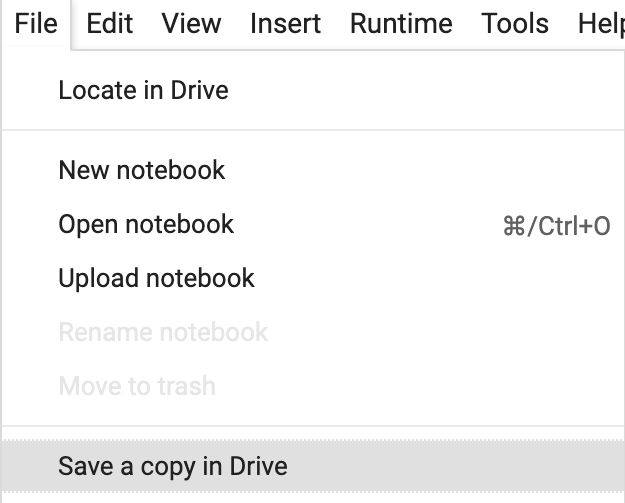
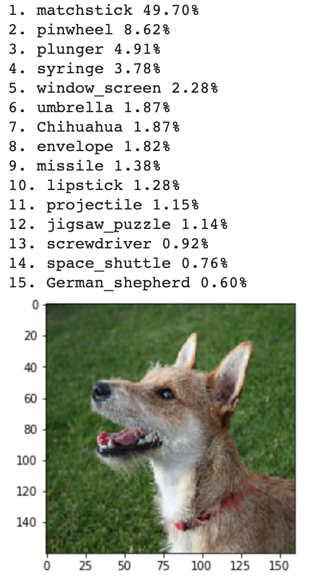
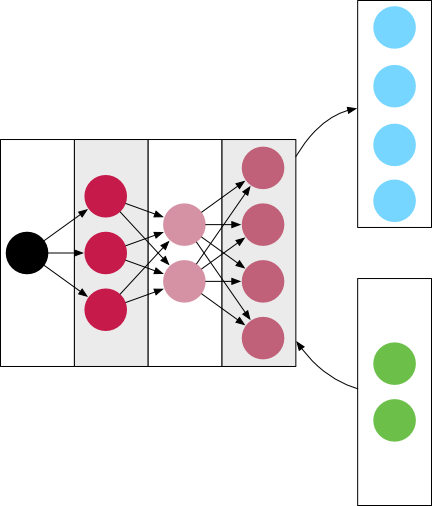

## Prepare your model for retraining

Instead of training a whole new model, for this project you'll load an existing one, called MobileNetV2, and change what it classifies. The MobileNetV2 model is trained to classify lots of different images, which means it is already trained to identify interesting features of an image. So retraining it to use these features to recognise cats or dogs will be much quicker than if you created an 'Is this a cat or a dog?' model from scratch.

--- collapse ---
---
title: What is a machine learning model?
---

A model is a set of rules a computer has learned to complete a task, such as determining what is in a picture it's shown.

These rules are divided up into **layers**. Each layer looks at the results of the one before it and tests them against some rules to decide what results to pass to the next layer.


Within each layer there are nodes, which have each learned a rule while the model was being trained, and will test it and produce a result when the model is predicting.

The very first layer is the input to the model — an image in this case. The first layer is often called the input layer for this reason. The last (output) layer of a classifier model like this will always have a number of nodes equal to the number of classifications the model is trained to identify. For example, in the model for this project, there will be two nodes in the final layer, as it will classify its inputs into either pictures of dogs or pictures of cats.

--- /collapse ---

A Google Colab project has been prepared for you with some starter code. The first thing to do is to open that up and save your own copy to work on.

--- task ---

Open the [Google Colab starter notebook](https://colab.research.google.com/drive/1uKqhEOSu9pIKVwgw4GOHqeq-jzPaYYMH#scrollTo=gebsfn75wKRg){:target="_blank"}  for this project in a new tab in your browser.

--- /task ---

--- task ---

Before you start changing anything, make sure you save the notebook to your drive so you can keep your work! Choose `File > Save a copy in Drive` and sign in to your Google account if prompted.



--- /task ---

--- task ---

First, define the size of the images that you will use. The dataset that you'll use to train the model is made up of 160x160 pixel images and that value is already stored in an `IMAGE_SIZE` variable. However, because of how colour works on computers, the images are actually three sets of 160x160 pixels — one each of the red, blue, and green values that combine to form the colour displayed at any given pixel. You can see more details on this below.

In the first empty cell, create an `IMAGE_SHAPE` variable:

```python3
IMAGE_SHAPE = (IMAGE_SIZE, IMAGE_SIZE, 3)
```

This tells the program that images will be 160x160 pixels, with three layers of colour.

--- /task ---

[[[generic-theory-colours]]]

--- task ---
Now, below your `IMAGE_SHAPE` variable, import the MobileNetV2 model — which is trained to identify loads of different objects — pass it your `IMAGE_SHAPE` as its `input_shape` and store it in an `original_model` variable.

```python
original_model = tf.keras.applications.MobileNetV2(input_shape=IMAGE_SIZE)
```
--- /task ---

Since MobileNetV2 is designed to run on a mobile device with limited battery, like a phone, it's not as large or as powerful as some other models. This means it doesn't always make the best guesses. Before you start changing it, test how good it is by asking it to identify a photo of a dog. Functions to let you do this easily have already been included in the notebook, but to understand how they work, check out the ['Testing your computer's vision' project](#).

--- task ---
Below the model import, add this line:

```python
predict_with_old_model('https://dojo.soy/predict-dog')
```

--- /task ---

--- task ---
Now run all the code and see how good the model's predictions are!

You can run all the code by opening the `Runtime` menu and choosing `Run all`. The first time you do this, it might take a while, because your program will have to download a lot of data both for the training dataset and the model itself.
--- /task ---



There are a couple of dog breeds in there, but most of the model's preferred classifications aren't very good! That's why you're going to improve it!

--- task ---
Remove the call to `predict_with_old_model`. You only needed it for testing.
--- /task ---

You need to remove the top layer from the existing MobileNetV2 model. This is where the model decides which of the objects it's been trained to identify are in the image, so you need to remove it to add your own layers related to cats and dogs. You can do this when you load the model.



--- task ---
Update the line where you load the `original_model` to add the `include_top` parameter and set it to `False`.

```python
original_model = tf.keras.applications.MobileNetV2(input_shape=IMAGE_SHAPE, include_top=False)
```
--- /task ---

Finally, because you don't want to change anything else in the original model, you should set it to be untrainable.

--- task ---

Below the line where you create `original_model`, set its `trainable` property to `False`.

```python
original_model.trainable = False
```

--- /task ---

--- save ---
