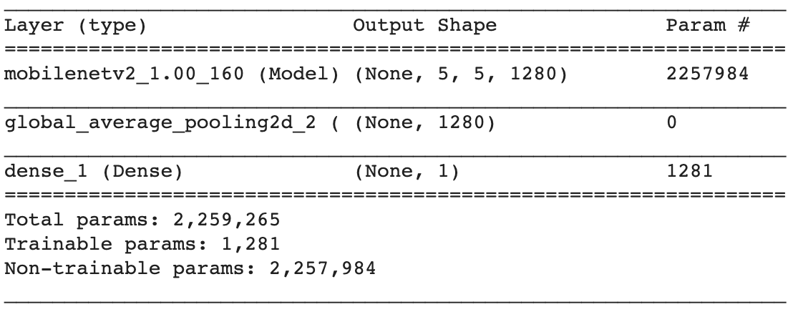

## Add your new layers

In order to train the MobileNetV2 model you've loaded to identify cats and dogs, you need to add two layers to it. One to convert the existing outputs of the model into a format that makes sense for your images, and the other to give the final classification of the image as either a cat or a dog. 

The model doesn't actually know these are cats and dogs, of course, it's just using the two nodes to represent two different categories of things. Which category is cats, and which is dogs, is something that the pre-written `predict_image` function — which you'll use to test images later — will translate for you by using the **labels** that came with the original training data.

--- task ---
In the next blank cell in the notebook, add this line of code to create the layer that reshapes the outputs of the existing model and stores it in a variable.

```python
global_average_layer = tf.keras.layers.GlobalAveragePooling2D()
```
--- /task ---

You just used that layer type as TensorFlow supplies it, but for the next one you need to take what you know about your data and apply it: because this classifier has to decide between two classes, its output should be two numbers. The higher number will indicate the predicted class.

--- task ---
Below the `global_average_layer`, add a variable for `prediction_layer`:

```python
prediction_layer = tf.keras.layers.Dense(2)
```
--- /task ---

Now you need to put your layers together with the original model you imported. This is done by using the `Sequential` function, because you assemble them in the sequence you pass them to the function, from bottom to top.

--- task ---

Below your `prediction_layer` variable, add the following code to combine your layers with the MobileNetV2 model.

```python
model = tf.keras.Sequential([
  original_model,
  global_average_layer,
  prediction_layer
])
```

This stacks the `global_average_layer` and the `prediction_layer` on top of the `original_model`.
--- /task ---

Next, you have to **compile** your model — convert it into a form that you can train and use to make predictions. To do this, you need to set two values: the **learning rate** of your model, and a **loss function**. 

The learning rate tells your model how quickly to learn. You don't want it too small, as it might take far too long to learn anything. However, you don't want it too big or your model may rush ahead with the first thing that seems right, and miss an important rule or insight. You'll use a learning rate of `0.0001`.

The loss function is how your model checks its performance during training. You'll use one called cross-entropy loss, which is a good choice for image classification.

--- task ---
Below your existing code, create a variable for the base learning rate, then compile the model with that parameter and cross entropy loss. Also, tell the model to print out its accuracy as it is training.

```python
BASE_LEARNING_RATE = 0.0001
model.compile(optimizer=tf.keras.optimizers.RMSprop(lr=BASE_LEARNING_RATE),
              loss=tf.keras.losses.BinaryCrossentropy(),
              metrics=['accuracy'])
```
--- /task ---

Finally, take a look at the model you've compiled.

--- task ---
Below the code you already have, add this line:

```python
model.summary()
```
--- /task ---

--- task ---
Run all the code in the notebook by opening the `Runtime` menu and choosing `Run all`.
--- /task ---



Look at the summary of the model that's printed out. In particular, look at the last three lines. This model has over two million parameters, but you're only training a little over a thousand of them. This is the huge advantage of retraining a model, over building an entirely new one; there's a lot less to train, so it will train much faster.

--- save ---
