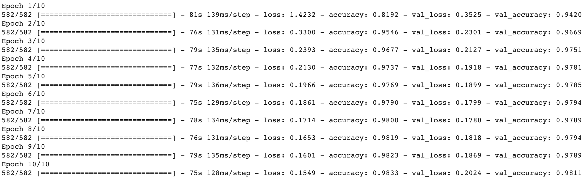

## Retrain the model

You've prepared your data, you've built your model, now it's time to get training!

The first thing you need to do is set the number of **epochs** you'll train for. An epoch is a complete pass through the training data. Usually, you want to go through the training data multiple times, in order to get the best result. However, each epoch adds to the time it will take to train the model, so you don't want to use too many. For now, you'll use ten epochs.

--- task ---

In the next blank cell, create a `TRAINING_EPOCHS` variable and set it to `10`.

```python
TRAINING_EPOCHS = 10
```

--- /task ---

However, even with only ten epochs, this is still a lot of data and will take a long time to train. In fact, if you were to train the model right now, it would take over an hour! Luckily, Colab allows you to set your notebook to use GPUs — graphics processing units, the same hardware used for video games — instead of CPUs — central processing units, the general-purpose processor that does most of the work on a computer. Because of the kind of mathematics the computer carries out for machine learning, it turns out the GPUs are much faster than CPUs.

So tell TensorFlow to use the GPU device when it fits your model. You'll need to provide the training and validation batches you created earlier to the `model.fit` function.

--- task ---
Below your `TRAINING_EPOCHS` line, add the following:

```python
with tf.device('/device:GPU:0'):
  history = model.fit(training_batches,
                      epochs=TRAINING_EPOCHS,
                      validation_data=validation_batches)
```
--- /task ---

--- task ---
Run all the code in the notebook by opening the `Runtime` menu and choosing `Run all`.

This is going to take some time, probably more than ten minutes. Leave the tab open and check back about once a minute to see your model printing out the results for each epoch. Watch as the loss goes down and the accuracy goes up!
--- /task ---



--- save ---
