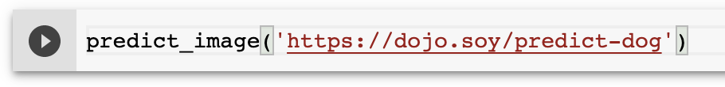

## Test your model

Now you've got a working model, you can use pictures of cats and dogs to test it!

--- task ---

In the last empty cell, add a call to `predict_image` and pass it the URL to a test image.

```python
predict_image('https://dojo.soy/predict-dog')
```

--- /task ---

Remember how long all that training took? You don't want to wait through that every time you want to test an image, so you need to stop using the `Run all` option. Instead, click the ▶ button that appears to the left of the cell to run only the contents of that cell.



--- task ---

Run the image prediction code and check out the results!

--- /task ---

--- save ---

--- task ---

Try to load a few different images into it to see what predictions it makes. You'll have to use images hosted on the internet. You can use the instructions below to store the images in Google Drive and create URLs for them that you can pass to `predict_image`.
You'll also have to make sure they're `.jpg` files, or modify the `get_image_from_url` function that was supplied with the notebook.

--- /task ---

[[[generic-google-drive-image]]]
